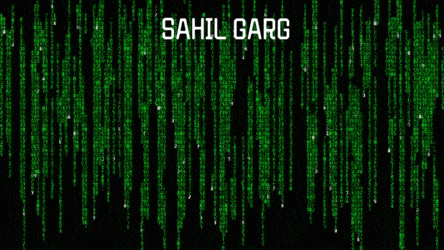

THIS PAGE IS UNDERDEVELOPMENT
<html>
<body>
 <h1 align="center">HELLO!  BONJOUR!  HOLA!  NAMASTE!</h1>
 <h3>Currently pursuing Computer Science Engineering with Specialization in Data Science from VIT, Vellore. Been practicing Python for almost 4 years and now into C and C++ for competitive programming. Being an aspiring Data Science currently learning and working under the domain of ML and AI.</h3>
 
 

 <\img>
  #mainDiv{Width:100%;}
  #centeredImage {margin-left:auto;margin-right:auto;float :none;}
  <\div>
</body>
</html>
<!---
sahilgarg201/sahilgarg201 is a ✨ special ✨ repository because its `README.md` (this file) appears on your GitHub profile.
You can click the Preview link to take a look at your changes.
--->

